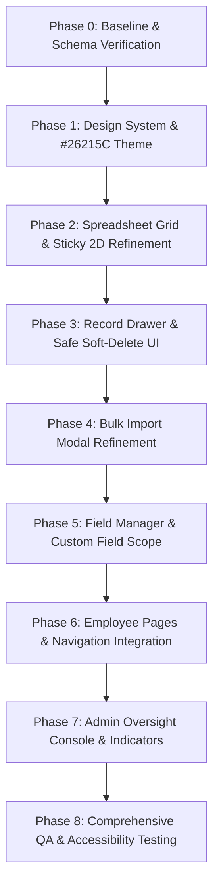

# CRM Pre-Implementation Technical Audit Report

## 1. Executive Summary
This technical audit inspects the current codebase of the CRM system (`C:\Users\user\.gemini\antigravity\scratch\crm-system`) against the approved **Product Use Cases & Role Permissions PRD (v1)** and the **UI/UX Pages & Navigation Specification (v1)**.

### Overall Status: `PARTIAL (READY FOR UI/UX PHASING)`
- **Core Spreadsheet Engine**: `READY` — 2D Grid, inline cell editing, keyboard navigation (`Tab`, `Shift+Tab`, `Enter`, `Esc`), auto-save state feedback, multi-draft row creation, multi-column search/filter/sort, and Excel/Google Sheets bulk copy-pasting are **fully implemented and working**.
- **Data Ownership Model**: `READY` — Records belong to workspaces, and any employee with access to a workspace can manage **all records** inside it.
- **Authentication & User Registration**: `MISSING` — Currently relies on an unauthenticated profile selection cookie (`current_employee_id`). Public signup, password hashing, email verification, password reset, and session cookies are missing.
- **Soft Deletion**: `BLOCKED (SCHEMA PREREQUISITE)` — `schema.prisma` lacks `isDeleted` or `deletedAt` fields. Deleting a record currently executes a permanent database deletion (`prisma.record.delete`).
- **Server-Side Authorization**: `PARTIAL` — Record Server Actions (`records.ts`) validate record existence and workspace association, but **fail to verify server-side user ownership/authorization**.
- **Fixed Theme Alignment**: `NEEDS REFINEMENT` — Current codebase uses gray/slate and blue (`#2563EB`). Needs standardization to the fixed `#26215C` indigo palette.

---

## 2. Current Architecture & File Structure

```
crm-system/
├── prisma/
│   └── schema.prisma                   # Database Schema (Employee, Workspace, FieldDefinition, Record, ActivityLog)
├── src/
│   ├── app/
│   │   ├── actions/
│   │   │   ├── employees.ts            # Server Actions: createEmployee
│   │   │   ├── fields.ts               # Server Actions: addField, renameField, deleteField, reorderFields
│   │   │   ├── records.ts              # Server Actions: createRecord, updateRecord, deleteRecord, bulkCreateRecords
│   │   │   └── workspaces.ts           # Server Actions: setEmployeeCookie, createWorkspace, renameWorkspace, deleteWorkspace
│   │   ├── api/
│   │   │   ├── test-field/             # Test API route
│   │   │   └── test-flow/              # Test API route
│   │   ├── globals.css                 # CSS variables & Tailwind setup
│   │   ├── layout.tsx                  # Root App Layout
│   │   ├── page.tsx                    # Landing / Profile Switcher page
│   │   ├── overview/                   # Company Overview (/overview)
│   │   └── workspaces/[workspaceId]/   # Workspace Grid (/workspaces/[workspaceId])
│   │       ├── page.tsx
│   │       ├── layout.tsx
│   │       ├── records-client.tsx
│   │       ├── spreadsheet-grid.tsx
│   │       ├── bulk-import-dialog.tsx
│   │       └── settings/
│   │           ├── page.tsx
│   │           ├── fields-manager.tsx
│   │           └── WorkspaceSettingsActions.tsx
│   ├── components/
│   │   ├── AppSidebar.tsx
│   │   ├── AppSidebarClient.tsx
│   │   ├── CreateEmployeeDialog.tsx
│   │   ├── EmployeeListClient.tsx
│   │   └── ui/                         # Shared UI Primitives (button, input, dialog, select, checkbox, table)
│   └── lib/
│       ├── prisma.ts                   # Prisma client singleton
│       └── record-utils.ts             # Filter parsing & record utility helpers
└── docs/
    ├── CRM-USE-CASES-AND-PERMISSIONS.md
    ├── CRM-UI-UX-PAGES-AND-NAVIGATION.md
    └── CRM-PRE-IMPLEMENTATION-TECHNICAL-AUDIT.md
```

---

## 3. Database / Schema Findings

Inspection of `prisma/schema.prisma`:

| Model | Schema Status | Ownership & Field Capabilities | PRD Compliance & Missing Requirements |
| :--- | :---: | :--- | :--- |
| **`Employee`** | `PARTIAL` | `id`, `name`, `role` (default `"USER"`), `createdAt`, `updatedAt` | ❌ **Missing Auth Fields**: `email`, `password` (hashed), `emailVerified`, `status` (`Active`/`Disabled`/`Unverified`), `passwordResetToken`, `resetTokenExpiry`. |
| **`Workspace`** | `READY` | `id`, `name`, `employeeId` (Owner link), `createdAt`, `updatedAt` | ✅ Single owner per workspace model supported. |
| **`FieldDefinition`** | `READY` | `id`, `workspaceId`, `name`, `type`, `options` (Json), `order`, `isRequired`, `createdAt`, `updatedAt` | ✅ Unique `[workspaceId, name]`. Independent workspace schemas supported. |
| **`Record`** | `PARTIAL` | `id`, `workspaceId`, `createdById`, `updatedById`, `data` (Json), `createdAt`, `updatedAt` | ❌ **Missing Soft-Delete Fields**: Lacks `isDeleted` (Boolean) or `deletedAt` (DateTime). Destructive delete currently used. |
| **`ActivityLog`** | `READY` | `id`, `recordId`, `employeeId`, `action`, `timestamp` | ✅ Supports audit logging for record operations. |

---

## 4. Existing Functionality Audit Table

| Feature Capability | Implementation Status | Technical Location / Details |
| :--- | :---: | :--- |
| **Workspace Creation** | `READY` | `createWorkspace` in `src/app/actions/workspaces.ts`. Auto-generates default fields. |
| **Workspace Isolation** | `PARTIAL` | UI client isolates navigation, but Server Actions in `records.ts` lack server-side owner checks. |
| **Employee All-Record Access** | `READY` | All records inside workspace loaded & editable by any authorized workspace user. |
| **Admin Console Access** | `PARTIAL` | `Employee.role` column exists, but `/admin/*` routes and `⚠️ Viewing as Admin` banner are missing. |
| **Inline Cell Editing** | `READY` | `spreadsheet-grid.tsx` supports double-click & single-click + type editing across 10 field types. |
| **Keyboard Navigation** | `READY` | `Tab` (right), `Shift+Tab` (left), `Enter` (down row), `Esc` (cancel), `Arrow keys` supported. |
| **Auto-Save & Status Badges** | `READY` | Cell commit on `Tab`/`Enter`/`blur` triggers debounced update with `Saving...` spinner and `Saved` check. |
| **Multi-Draft Rows** | `READY` | Clicking "+ New Record" appends independent draft rows with individual state & save triggers. |
| **Bulk Copy / Paste & Import** | `READY` | `bulk-import-dialog.tsx` supports Excel/Sheets tab/newline parsing, column mapping, & duplicate warnings. |
| **Global Keyword Search** | `READY` | Search input filters workspace records in real-time. |
| **Multi-Column Filtering** | `READY` | Filter popover builder supports 7 operators (`contains`, `eq`, `neq`, `is_checked`, etc.). |
| **Column Header Sorting** | `READY` | Column header clicks toggle `asc` / `desc` ordering. |
| **Pagination / Scrolling** | `READY` | 25 records per page + bounded sticky 2D scrolling container (`sticky top-0`, `sticky left-0`). |
| **Dynamic Custom Fields** | `READY` | `fields-manager.tsx` manages workspace fields without global normalization. |
| **Record Deletion** | `PARTIAL` | Executes permanent database deletion (`prisma.record.delete`). Soft deletion is `MISSING`. |
| **Activity Logging** | `PARTIAL` | `ActivityLog` entries written on `CREATE` and `UPDATE`. Standalone Activity Page UI is `MISSING`. |
| **Responsive Layout** | `PARTIAL` | Mobile menu hamburger and responsive toolbar present. Cell drawer and mobile wizard need refinement. |

---

## 5. Permission & Security Findings

1. **Server-Side Authorization Deficit**:
   - In `src/app/actions/records.ts`, `updateRecord` and `deleteRecord` verify that `existingRecord.workspaceId === workspaceId`.
   - **Critical Deficit**: They do **NOT** verify whether `currentEmployeeId` actually owns `workspaceId` or possesses an `ADMIN` role. Any authenticated session passing a valid `workspaceId` can modify or delete records.
2. **Profile Selection vs. Real Authentication**:
   - Currently, user session relies on `current_employee_id` stored in an unencrypted HTTP cookie (`setEmployeeCookie`).
   - Anyone can switch profiles without password authentication via `/` or the sidebar dropdown.
3. **Public Admin Signup Prevention**:
   - Currently, `createEmployee` assigns `role = "USER"`. Public self-registration UI does not exist yet.
4. **Data Ownership Compliance**:
   - Records belong to workspaces. The `createdBy` field is stored for audit purposes only and is **not** used to restrict record editing, which strictly aligns with the PRD.

---

## 6. Authentication & Security Readiness

| Feature | Status | Requirement / Missing Details |
| :--- | :---: | :--- |
| **Employee Self-Registration** | `MISSING` | Requires `/signup` route, email validation, and password input. |
| **Password Hashing** | `MISSING` | `bcrypt` / `argon2id` hashing is not integrated into `Employee` creation. |
| **Login & HTTP-Only Sessions** | `MISSING` | Requires `/login` route, credentials validation, and secure session cookies/JWT. |
| **Email Verification** | `MISSING` | Requires `emailVerified` column, token generation, and `/verify-email` endpoint. |
| **Password Reset** | `MISSING` | Requires `passwordResetToken`, `resetTokenExpiry`, and `/forgot-password` workflow. |
| **Admin Seed Provisioning** | `MISSING` | Requires dedicated CLI seed script or setup environment provisioning. |
| **Server-Side Auth Middleware** | `MISSING` | Requires server-side session & role verification on every protected route and Server Action. |

---

## 7. Soft-Delete Feasibility Analysis

### Status: `NO — SCHEMA CHANGE REQUIRED (OR BACKEND PREREQUISITE)`

- **Current Implementation**: `src/app/actions/records.ts` calls `prisma.record.delete({ where: { id } })`, executing a permanent SQL `DELETE`.
- **Schema Reality**: `model Record` in `prisma/schema.prisma` contains no `isDeleted` (Boolean) or `deletedAt` (DateTime) attributes.
- **Guardrail Action**:
  - In accordance with Implementation Guardrails, **no database schema changes will be made without explicit prior approval**.
  - For Phase 3 implementation, soft deletion will be documented as a backend prerequisite. Destructive database deletion will be suppressed in the UI, and deletion confirmation dialogs will display a "Planned / Archive" notice while preserving safe existing records.

---

## 8. UI/UX Implementation Readiness

### Reusable Component Assets
- `SpreadsheetGrid` (`spreadsheet-grid.tsx`): Highly functional spreadsheet grid engine.
- `EditableCell` (`spreadsheet-grid.tsx`): Supports 10 field types with auto-save status indicators.
- `BulkImportModal` (`bulk-import-dialog.tsx`): Excel/Google Sheets copy-paste modal with column mapping.
- `FieldManager` (`fields-manager.tsx`): Workspace custom field schema manager.
- `AppSidebarClient` (`AppSidebarClient.tsx`): Sidebar navigation frame.

### UI / Theme Alignment Gaps
- **Color Theme**: Current codebase uses generic blue (`#2563EB`) and slate gray. Must be updated to the fixed palette:
  - **Sidebar / Deep Indigo-Black**: `#26215C`
  - **Primary Accent**: `#534AB7`
  - **Hover / Lighter Accent**: `#7F77DD`
  - **Pale Lavender Accent Background**: `#EEEDFE`
  - **Text on Accent**: `#3C3489`
- **Missing Pages / Views**:
  - Auth pages (`/login`, `/signup`, `/verify-email-pending`, `/forgot-password`, `/reset-password`).
  - Slide-over `RecordDrawer` component for expanded record inspection & audit timeline.
  - Standalone Workspace Activity page (`/workspaces/[id]/activity`).
  - Profile & Security Settings page (`/settings/profile`).
  - Admin Oversight Console (`/admin/*`) with `⚠️ Viewing as Admin` banner override.

---

## 9. Risks, Contradictions & Missing Prerequisites

1. **Risk 1: Unauthenticated Server Actions**:
   - `records.ts` allows any caller with a valid `workspaceId` to execute CRUD operations without verifying user workspace ownership on the server.
2. **Risk 2: Destructive Record Deletes**:
   - `deleteRecord` permanently purges records from PostgreSQL.
3. **Prerequisite 1: Database Schema Expansion for Auth & Soft-Delete**:
   - `Employee` needs `email`, `password`, `emailVerified`, `status`, `passwordResetToken`.
   - `Record` needs `isDeleted` or `deletedAt`.
   - *Requires explicit user approval before modifying `schema.prisma`.*

---

## 10. Recommended Implementation Sequence



### Phase Details & Target Files

#### Phase 0: Baseline & Schema Verification (`READY`)
- Inspect and verify baseline capabilities. Do not change database schema or code.

#### Phase 1: Design System & Layout Foundation (`BLOCKED ON CODING START`)
- Standardize CSS variables in `globals.css` and `AppSidebarClient.tsx` using `#26215C` indigo palette.
- Files: `src/app/globals.css`, `src/components/AppSidebarClient.tsx`, `src/app/layout.tsx`.

#### Phase 2: Spreadsheet Grid & Sticky 2D Scrolling Refinement (`BLOCKED ON CODING START`)
- Refine `SpreadsheetGrid` and `EditableCell` with `#534AB7` selection rings, `#EEEDFE` lavender draft rows, and sticky headers (`sticky top-0 z-20`, `sticky left-0 z-10`).
- Files: `src/app/workspaces/[workspaceId]/spreadsheet-grid.tsx`.

#### Phase 3: Record Details Drawer & Safe Deletion (`BLOCKED ON CODING START`)
- Build right-sliding `RecordDrawer` for expanded record editing, audit metadata, and safe soft-deletion confirmation dialogs.
- Files: `src/components/RecordDrawer.tsx` (new), `src/app/workspaces/[workspaceId]/records-client.tsx`.

#### Phase 4: Bulk Import Modal Refinement (`BLOCKED ON CODING START`)
- Refine `BulkImportModal` for Excel/Google Sheets copy-pasting (`Ctrl+V`), tab/newline parsing, preview validation, and import summary.
- Files: `src/app/workspaces/[workspaceId]/bulk-import-dialog.tsx`.

#### Phase 5: Workspace Field Manager (`BLOCKED ON CODING START`)
- Refine `FieldManager` interface for custom fields without global schema normalization.
- Files: `src/app/workspaces/[workspaceId]/settings/fields-manager.tsx`.

#### Phase 6: Employee Pages & Navigation (`BLOCKED ON CODING START`)
- Build Employee Dashboard, active filter displays, workspace switcher, and profile settings.
- Files: `src/app/overview/OverviewClient.tsx`, `src/app/workspaces/[workspaceId]/activity/page.tsx` (new).

#### Phase 7: Admin Oversight Console (`BLOCKED ON CODING START`)
- Build Admin Overview (`/admin/overview`), Employee accounts table, Workspace global index, and `⚠️ Viewing as Admin` banner override.
- Files: `src/app/admin/*` (new routes & components).

#### Phase 8: Comprehensive QA & Permission Testing (`BLOCKED ON CODING START`)
- Server-side authorization checks, responsive testing across desktop/tablet/mobile, and regression verification.

---

## 11. Items Requiring Explicit Approval Before Coding

> [!IMPORTANT]
> The following items require user review and explicit approval before any code or schema modifications begin:
> 
> 1. **Prisma Schema Update for Authentication**: Approval to add `email`, `password` (hashed), `emailVerified`, `status`, and `passwordResetToken` to `model Employee`.
> 2. **Prisma Schema Update for Soft Deletion**: Approval to add `isDeleted Boolean @default(false)` and `deletedAt DateTime?` to `model Record`.
> 3. **Server-Side Authorization Refactoring**: Approval to update `records.ts` Server Actions to enforce server-side employee workspace ownership verification.
