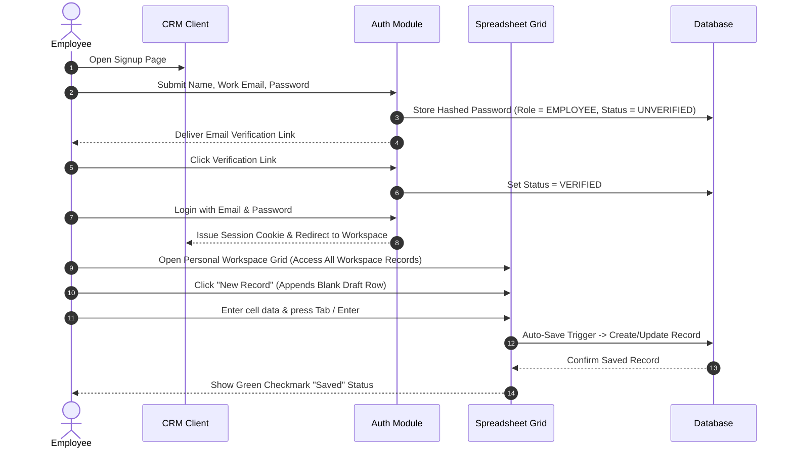
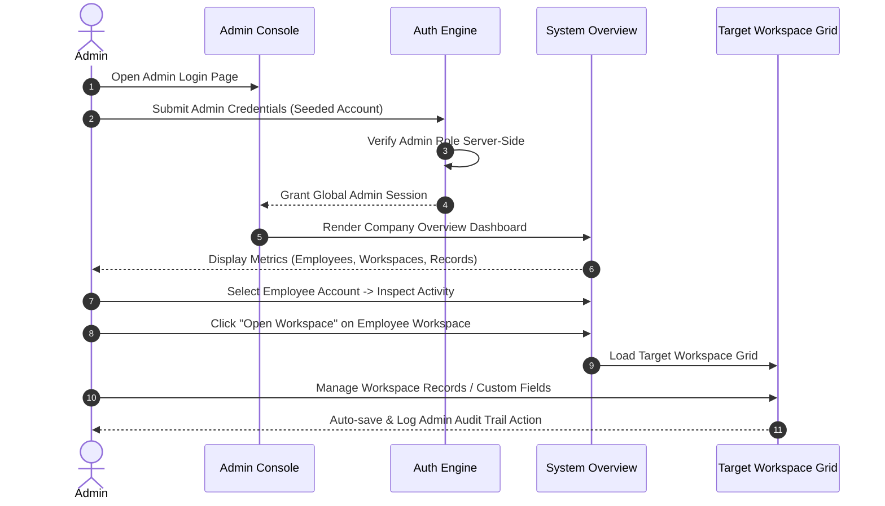

# CRM Product Use Cases & Role Permissions v1

## 1. Product Purpose and Scope
The CRM System is a commercial, enterprise-grade Lead & Contact Management platform featuring a **spreadsheet-first user experience** inspired by tools like Google Sheets, Airtable, and Zoho Tables. 

The primary objective of the application is to empower organizations and their employees to efficiently collect, organize, search, edit, bulk import, and manage contact and sales lead data. The application balances maximum data-entry productivity (via inline grid editing, keyboard navigation, and direct multi-cell copy-pasting) with strict multi-tenant access control, workspace isolation, and robust role-based security boundaries.

Workspace ownership belongs to one Employee owner in v1. Records belong to the workspace itself, allowing any employee with access to a workspace to view, edit, delete, and manage **all records inside that workspace**, regardless of who created them. Admins maintain global oversight across all workspaces.

---

## 2. User Roles
The platform defines two distinct system roles:

| Role | Description |
| :--- | :--- |
| **Employee** | Standard operational user. Owns and manages individual workspace(s). Can view, add, edit, delete, search, filter, sort, and manage **all records** and custom fields inside their own workspace(s). Cannot view or access other employees' workspaces or records. |
| **Admin** | System administrator and management role. Possesses global visibility and management authority across all employees, workspaces, records, custom fields, system statistics, activity logs, and system operations. |

---

## 3. Employee Use Cases
- **UC-EMP-01 (Account Self-Service)**: Employee registers via public signup, verifies work email, logs in, logs out, and requests password resets securely.
- **UC-EMP-02 (Workspace Management)**: Employee creates, names, renames, and organizes personal workspaces for different lead channels or sales pipelines.
- **UC-EMP-03 (Spreadsheet Record Management)**: Employee views, adds, edits, deletes, searches, filters, and sorts **all records** inside their workspace in a Google Sheets-style 2D grid with sticky headers and sticky row numbers.
- **UC-EMP-04 (Inline Grid Editing & Auto-Save)**: Employee clicks or keyboard-navigates into any cell, edits data inline, and auto-saves changes on cell exit (`Tab`, `Enter`, `blur`).
- **UC-EMP-05 (Multi-Row Creation)**: Employee clicks "New Record" to add multiple blank rows into the grid simultaneously and populates them before committing.
- **UC-EMP-06 (Bulk Copy/Paste & Import)**: Employee pastes tab-delimited text directly from Excel or Google Sheets into the grid, or uses a guided Bulk Paste/Import modal.
- **UC-EMP-07 (Custom Field Configuration)**: Employee configures workspace-specific fields (Add, Rename, Delete, Reorder, Required/Optional, Field types, and Dropdown/Multi-Select options) within their own workspace.
- **UC-EMP-08 (Search, Filter & Sort)**: Employee runs global keyword searches, multi-column filters, and header sorting across all records in their workspace.
- **UC-EMP-09 (Personal Workspace Activity View)**: Employee inspects audit logs and activity history for their accessible workspace(s).

---

## 4. Admin Use Cases
- **UC-ADM-01 (Secure Admin Access)**: Admin logs in using securely provisioned credentials created through a protected setup process (no public signup access).
- **UC-ADM-02 (Employee Account Management)**: Admin views all registered employees, inspects profile details, and activates, deactivates, or locks employee accounts.
- **UC-ADM-03 (Global Workspace Oversight)**: Admin views, browses, and opens any employee workspace in the organization.
- **UC-ADM-04 (Global Record CRUD & Export)**: Admin views, edits inline, creates, deletes, and exports records from any workspace across the platform.
- **UC-ADM-05 (Workspace Custom Field Management)**: Admin manually inspects, creates, or modifies custom field definitions across any workspace when needed. (Note: Automatic schema normalization across workspaces is **not** required in v1; each workspace maintains its independent custom field structure).
- **UC-ADM-06 (System Analytics & Reporting)**: Admin inspects organization-wide dashboard metrics (total employees, active workspaces, total record counts, daily activity volume).
- **UC-ADM-07 (Organization Audit & Security Logs)**: Admin views complete system-wide audit logs detailing who performed which action across all workspaces.

---

## 5. Authentication and Registration Flow

### Employee Registration & Sign-in
1. **Public Signup Form**: Public registration endpoints strictly assign the `Employee` role. Users can never select or assign themselves the Admin role. Employee inputs `Name`, `Work Email`, and `Password`.
2. **Password Standards**: Minimum 8 characters, requiring at least one uppercase letter, one number, and one special character. Passwords must **never be stored as plain text** and must be hashed using a strong algorithm (`bcrypt` or `argon2id`).
3. **Email Verification**: System sends a time-bound verification token link to the work email. Employee account remains in `UNVERIFIED` status until link activation.
4. **Login & Session Management**: Employee logs in using verified email and password. System issues secure HTTP-only cookies or JWT tokens.
5. **Password Reset**: Employee initiates "Forgot Password". System validates work email, delivers a single-use token link, and allows password resetting.

### Admin Provisioning & Security Requirements
1. **No Public Admin Signup**: Public signup forms always register users as Employees. Admin account creation via public registration forms is strictly blocked.
2. **Controlled Provisioning Process**: Initial Admin credentials are created exclusively through a protected setup process, such as:
   - A protected CLI seed/setup script (`prisma db seed` in a controlled environment).
   - Secure environment variables used strictly during initial setup.
   - A protected administrative provisioning workflow.
3. **Admin Credential Security**:
   - **No Hardcoding**: Admin email and password must never be hardcoded in source code or committed to repositories.
   - **No Plain Text**: Admin passwords must be securely hashed (`bcrypt` / `argon2id`).
   - **No Exposure**: Admin credentials or secret setup tokens must never be exposed in client-side code, public documentation, frontend logs, or browser environment variables.
   - **Server-Side Enforcement**: Admin access and role authorization must be re-verified on the server on **every protected route, API endpoint, and Server Action**.

---

## 6. Employee Dashboard Requirements
- **Personal Overview Header**: Displays active employee profile, quick stats (personal active workspaces, total owned records, recent activity).
- **Workspace Selector**: Sidebar/dropdown listing all workspaces owned by the logged-in employee.
- **Spreadsheet Grid Workspace View**:
  - Bounded 2D scroll container with sticky header row and sticky left row-number column.
  - Multi-draft row creation ("+ Add Blank Row").
  - Auto-save state indicators per cell (`Saving...`, `Saved`, `Error / Retry`).
  - Search input, active filter chips, column selector trigger, and bulk paste modal launcher.

---

## 7. Admin Dashboard Requirements
- **Executive Metric Cards**: Total Employees, Total Workspaces, Total Lead Records, Total Organization Activity.
- **Employee Management Table**: List of all employees, registration date, active workspace count, record count, status badge (`Active` / `Disabled`), and account toggle controls.
- **Global Workspace Navigator**: Card grid or searchable table showing every workspace across all employees with direct "Open Workspace" deep links.
- **System Activity Feed**: Real-time cross-employee event stream with filterable controls by employee name, workspace, or action type (`CREATE`, `UPDATE`, `DELETE`).

---

## 8. Product Ownership & Workspace Permissions

### Workspace Ownership Model
1. **Single Owner per Workspace**: Each workspace is owned and managed by one Employee in v1.
2. **Strict Employee Isolation**: Other Employees cannot view, search, edit, open, or discover another employee's workspace.
3. **Global Admin Access**: Admin possesses global visibility and management access to open and manage any workspace.

### Workspace Record Access Model
1. **Records Belong to Workspace**: Lead and contact records belong to the **workspace**, not directly to individual employees.
2. **All-Record Workspace Management**: An Employee can view, add, edit, delete, search, filter, sort, and manage **ALL records** inside their workspace. Employees are **not** restricted to editing only records created by themselves.
3. **Audit Tracking (`createdBy`)**: The `createdBy` field is stored strictly for audit, activity logging, and historical tracking purposes. Creating a record does not create exclusive editing rights; any user with access to that workspace can manage all records within it.

---

## 9. Record Management Permissions

| Capability | Employee Role (Own Workspace) | Employee Role (Other Workspaces) | Admin Role (Any Workspace) |
| :--- | :---: | :---: | :---: |
| **View All Workspace Records** | ✅ Allowed | ❌ Blocked | ✅ Allowed |
| **Inline Grid Edit (Any Record)** | ✅ Allowed | ❌ Blocked | ✅ Allowed |
| **Auto-Save Cell Edits** | ✅ Allowed | ❌ Blocked | ✅ Allowed |
| **Add Single/Multiple Draft Rows** | ✅ Allowed | ❌ Blocked | ✅ Allowed |
| **Delete Any Workspace Record** | ✅ Allowed | ❌ Blocked | ✅ Allowed |
| **Bulk Edit / Update Records** | ✅ Allowed | ❌ Blocked | ✅ Allowed |

---

## 10. Custom Field Permissions

### Employee Scope (Own Workspace Only)
Employees can fully manage custom fields within their own workspace, including:
- Adding new fields
- Renaming existing fields
- Deleting fields
- Reordering field sequence in the grid
- Setting required vs. optional status
- Selecting field types (`TEXT`, `NUMBER`, `EMAIL`, `PHONE`, `LONG_TEXT`, `DROPDOWN`, `MULTI_SELECT`, `CHECKBOX`, `DATE`, `URL`)
- Configuring option lists for `DROPDOWN` and `MULTI_SELECT` fields

### Admin Scope
- Admin can manage custom fields in any workspace.
- **No Forced Schema Normalization**: Automatic field normalization or forced global schema standardization across workspaces is **not** required for v1. Each workspace maintains its own independent field configuration. Admin may manually review or edit fields when necessary.

---

## 11. Bulk Paste / Import Permissions
- **Google Sheets / Excel Multi-Cell Paste**: Both Employees (in personal workspaces) and Admins (in any workspace) can copy raw cells from Google Sheets or Excel and paste (`Ctrl+V` / `Cmd+V`) directly into the spreadsheet grid.
- **Delimiters**: Auto-parses tabs (`\t`) as columns and newlines (`\n`) as rows.
- **Guided Bulk Import Modal**: Provides field mapping preview, required field validation checks, duplicate detection warnings, and row-by-row batch insertion.

---

## 12. Search, Filter, Sort, and Export Permissions
- **Global Keyword Search**: Scans across all text, email, phone, and record payload fields for **all records** within the accessible workspace.
- **Multi-Column Filtering**: Supports operators: `contains`, `equals`, `greater_than`, `less_than`, `is_checked`, `is_unchecked`, `includes_option`.
- **Column Sorting**: Supports single and multi-column `asc` / `desc` ordering across all workspace records.
- **Data Export**:
  - **Employee**: Can export all records from owned workspaces to CSV / Excel format.
  - **Admin**: Can export data from any workspace or generate organization-wide data dumps.

---

## 13. Activity Log Permissions
- **Log Events Recorded**: `RECORD_CREATED`, `RECORD_UPDATED`, `RECORD_DELETED`, `BULK_IMPORTED`, `FIELD_CREATED`, `WORKSPACE_CREATED`.
- **Employee Scope**: Can view activity feed logs generated exclusively within their own accessible workspace(s).
- **Admin Scope**: Can view, search, and filter complete system activity logs across all employees, workspaces, and timestamps.

---

## 14. Detailed Employee User Flow

---

## 15. Detailed Admin User Flow

---

## 16. Permission Matrix

| Feature / Action | Employee Role (Own Workspace) | Employee Role (Other Workspaces) | Admin Role (Any Workspace) |
| :--- | :---: | :---: | :---: |
| **Self Registration (Employee Only)** | ✅ Allowed | ❌ N/A | ❌ (Controlled Setup Only) |
| **Self-Assign Admin Role** | ❌ Blocked | ❌ Blocked | ❌ Blocked |
| **View Workspace List** | ✅ Own Only | ❌ Blocked | ✅ All Workspaces |
| **Create Personal Workspace** | ✅ Allowed | ❌ N/A | ✅ Allowed |
| **View All Workspace Records** | ✅ Allowed | ❌ Blocked | ✅ Allowed |
| **Inline Grid Edit (All Workspace Records)** | ✅ Allowed | ❌ Blocked | ✅ Allowed |
| **Add Multi-Draft Rows** | ✅ Allowed | ❌ Blocked | ✅ Allowed |
| **Delete Any Workspace Record** | ✅ Allowed | ❌ Blocked | ✅ Allowed |
| **Bulk Paste from Excel / Google Sheets** | ✅ Allowed | ❌ Blocked | ✅ Allowed |
| **Manage Custom Fields (Add/Rename/Delete/Options)** | ✅ Own Workspace Only | ❌ Blocked | ✅ All Workspaces |
| **Export Workspace Records to CSV** | ✅ Own Workspace Only | ❌ Blocked | ✅ All Workspaces |
| **View Activity Logs** | ✅ Own Workspace Only | ❌ Blocked | ✅ All System Logs |
| **Manage Employee Account Status** | ❌ Blocked | ❌ Blocked | ✅ Allowed |
| **View System Analytics & Stats** | ❌ Blocked | ❌ Blocked | ✅ Allowed |

---

## 17. Security Rules
1. **Password Encryption**: All passwords must be salted and hashed using `bcrypt` (work factor >= 10) or `argon2id`. Plain text passwords are strictly forbidden.
2. **Server-Side Authorization**: Every API route and Server Action must explicitly query user identity and role from the server session. Front-end visibility toggles must be backed by strict database query filters (`WHERE workspace.ownerId = currentUserId`).
3. **Admin Credential & Role Protection**:
   - Admin accounts must never be created via public employee signup.
   - Public signup hardcodes assigned role to `EMPLOYEE`. Users cannot assign or elevate their role.
   - Admin credentials must never be hardcoded in source code or exposed in frontend code, public documentation, client environment variables, or logs.
   - Admin access must be re-verified on the server for **every protected route and server action**.
4. **Input Sanitization & Validation**: All user inputs (spreadsheet grid cells, bulk pastes, filter queries) must be validated server-side using schemas (e.g. `Zod`) to prevent XSS and injection attacks.
5. **Rate Limiting**: Authentication endpoints (`/login`, `/signup`, `/forgot-password`) must enforce rate limits to prevent brute-force attacks.

---

## 18. Data Ownership Rules
1. **Workspace Ownership**: Each workspace belongs to one Employee owner in v1.
2. **Record Belonging**: Records belong to the workspace, not directly to individual employees.
3. **All-Record Workspace Access**: Any employee with access to a workspace can view, edit, delete, search, filter, and sort **ALL records** in that workspace, regardless of who created them.
4. **Audit Tracking (`createdBy`)**: The `createdBy` field is used strictly for audit logging and historical tracking; it does not restrict editing rights within the workspace.
5. **Tenant Isolation**: Employees cannot view, search, or access other employees' workspaces or records.
6. **Admin Global Access**: Admin possesses global visibility and management access across all workspaces and records.
7. **Employee Offboarding**: Deactivating an employee account retains their workspaces and records for Admin review and re-assignment.

---

## 19. Important Edge Cases
1. **Multi-Cell Paste Across Page Boundaries**: If a user pastes 100 rows into a pagination view showing only 25 rows per page, the grid must process the full 100 records into the database and update pagination counts seamlessly without dropping data.
2. **Concurrent Cell Edits**: If an Admin and an Employee edit the same cell simultaneously, optimistic locking or timestamp-based last-write-wins must resolve conflicts with a visual notification.
3. **Partial Draft Row Auto-Save**: If a draft row has partial required fields filled (e.g., Email provided but required Name missing), auto-save must hold the row in local draft state, highlight the missing required cell in red, and block server submission until valid.
4. **Duplicate Record Detection**: If a unique field rule (e.g. unique Email) is violated during inline edit or bulk paste, the system must highlight the duplicate cell, present a duplicate warning dialog, and offer a "Skip" or "Ignore & Save" override option.
5. **Session Expiry During Inline Edit**: If an auth session expires while typing in a cell, the un-saved edit must be preserved in browser local storage and submitted immediately after re-authentication.

---

## 20. Features Explicitly Out of Scope for v1
- Third-party email marketing integration (e.g. Mailchimp, SendGrid integration).
- Automated phone dialing / VOIP calling integration.
- Custom workflow automation builder / visual Zapier-like triggers.
- Multi-currency conversion engines.
- Public web-form builder for external lead capture.
- Real-time multi-cursor collaborative editing web-sockets (Google Docs style multi-cursor indicators).
- Automatic cross-workspace custom field schema normalization.
